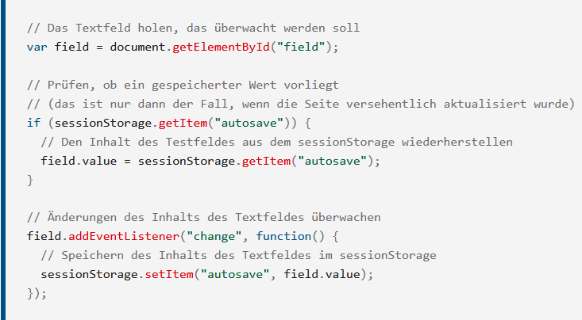

# Feature Request: Design Document Template
## Dezember 19th 2021

### OBJECTIVE
After user redirect on login, restoring the search term from before the redirect

### BACKGROUND 
Currently the redirect to get the Access Token after the first search is a critical issue in user experience. Due to the load after pressing the search button the first time, the input field will be set to empty and the user have to repeat the inserting of the search term. A very bad and annoying first impression of the website.

This feature accomplishes the following:
-  Ensure successful first search (more accurate: search with the necessity of a redirect) without the need to repeat the input

### TECHNICAL DESIGN
To store the inserted searchterm the sessionStorage should be used. The Implementation should follow the second example at this [side](https://developer.mozilla.org/de/docs/Web/API/Window/sessionStorage) (siehe Screenshot). 
The conditional with the `getItem`-call should be placed in the in the `ComponentDidMount()`-method of `Searchbar.js`. Here also the searchTerm-state should be updated using `setState()` The call of setItem should be inserted in `search()` in `App.js`. 

### CAVEATS
There several ways to pass Data between sides, which can be used to store data to be available after a redirect. The usage of 5 possible ways are well described on this [webside](https://code-boxx.com/pass-variables-between-pages-javascript/). As the searchTerm is highly temporary, the approach via the localStorage and Cookie is not suitable here. The redirect to another window is also not useful here. To use the query string of the url might also be a good option. As the url with the accesstoken and additional parameters is already quite long, adding an additional query string might look confusing. That’s why the usage of SessionStorage is preferred here.

An additional approach for facing the problem of loosing the searchTerm via redirect, might lay in a different place for the authentification process. This can be during in the ComponentDidMount()-method of App.js or in the onClick-handler of an additional button, which Color change in dependence of a valid accesstoken. The first approach may seem a bit suspicious to the user as he will be immediately redirected to another webside. Here also the expire mechanism should be updated, to enable the redirect to get a new accesstoken. This process could be initiated by a message to the user using window.alert(). After user confirmation the site will be redirected. In doing this the issue is not only solved for the first search but also for searchings after the expiration of the accesstoken. Here a lot changes in the code are necessary including the refactoring of the getAccessToken-method and its calls. But there is no remarkable improvement for the user experience. The separation of the login-process may force a higher awareness for the authentication status but is opposed to a lean webside experience. The Effort is here clearly not usful.

